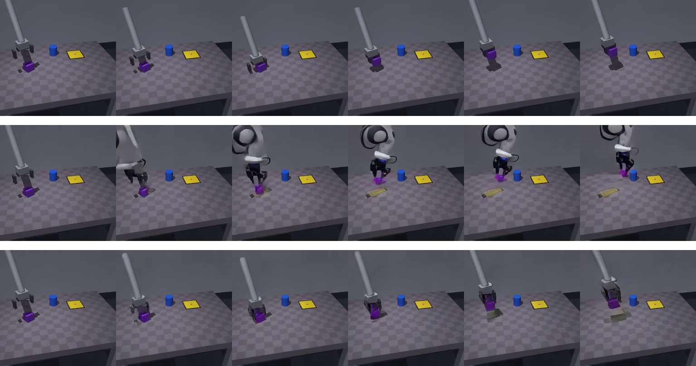
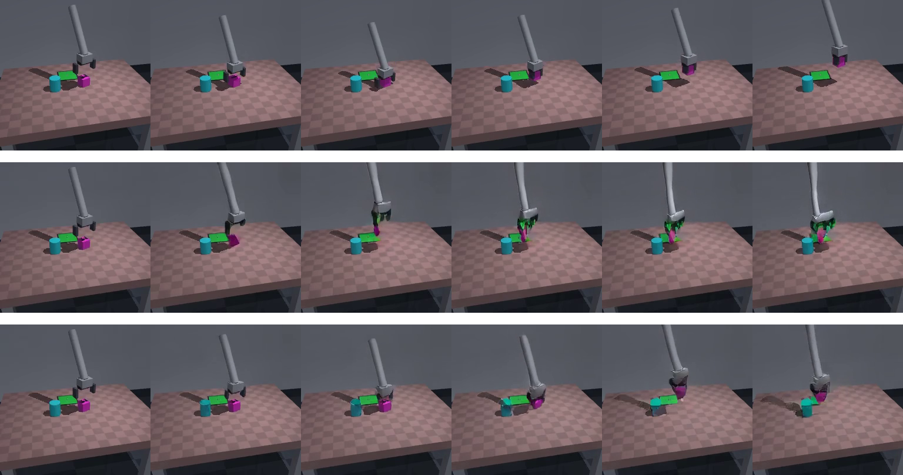

# LoRA fine-tuning pilot: results

Minimal pilot from [`FINETUNING_SCOPE.md`](FINETUNING_SCOPE.md), built and run
end-to-end: fresh dataset -> training script -> real training run -> before/after
evaluation against [`VALIDATION.md`](VALIDATION.md)'s own metrics, on held-out
episodes.

## What was built

- `lora_data.py` -- windows mujoco-env-dataset episodes into (first_frame, 16-action
  chunk, 17-frame ground-truth clip) samples; owns `register_mujoco_domain()`, the
  `_EMBODIMENT_TO_DOMAIN_ID`/`_EMBODIMENT_TO_RAW_ACTION_DIM` monkeypatch that
  registers a fresh domain id 21 (`"mujoco_pickplace"`) alongside the pretrained
  bridge/droid/umi/fractal domains, per FINETUNING_SCOPE.md section 3. Actions are
  fed in **natural, unscaled mujoco units** -- no VALIDATION.md-style empirical
  scale factor -- because the point of training a fresh domain's action-projection
  weights is that they learn their own scale from data, not from us guessing it.
- `train_lora_pilot.py` -- LoRA (r=8, alpha=16) on the 112
  `self_attn.{add_q_proj,add_k_proj,add_v_proj,to_add_out}` modules across 28
  layers, plus the new domain's `action_proj_in`/`action_proj_out` rows, unfrozen.
  Flow-matching velocity loss derived directly from `UniPCMultistepScheduler`'s own
  `flow_prediction` convention (`x_t=(1-sigma)x0+sigma*noise`, target velocity
  `v=noise-x0`), computed only at the noisy (non-conditioning) vision positions.
  Reuses the pipeline's own segment-builders and VAE encode
  (`_prepare_action_video_conditioning`, `_encode_video`, `_prepare_text/vision/
  action_segment`, `_mask_velocity_predictions`, `prepare_latents`) rather than
  reimplementing sequence packing.
- `eval_lora_pilot.py` -- runs `validate_action_conditioning.py`'s own methodology
  (grasp vs. stay-action rollouts, `frame_diff_energy`, cube `net_displacement`)
  against the new domain, on held-out **val** episodes (geometrically disjoint from
  train via mujoco-env-dataset's `combo_split` -- the generalization check
  FINETUNING_SCOPE.md flagged as risk #5).
- Dataset: 40 train / 10 val episodes generated fresh for this pilot
  (`/opt/dlami/nvme/cosmos-policy/lora_pilot/dataset`, 100% scripted-expert success).

## The run

800 steps, grad-accum 4 (effective batch 4), lr 1e-4, AdamW `weight_decay=0` (on
*all* trainable params -- both LoRA and the domain-embedding rows -- sidestepping
the weight-decay-leakage footgun FINETUNING_SCOPE.md flagged), no gradient
checkpointing needed (peak ~15.4 GiB, comfortably under budget). **24.3 minutes
wall-clock** -- well inside the scoped 1-4 GPU-hour estimate. Loss: first-40-step
average 0.101 -> last-40-step average 0.065 (~36% drop, noisy but a clear
downward trend, not yet plateaued).

## Before / after, on 5 held-out val episodes

| metric | baseline (untrained domain 21) | after 800 steps |
|---|---|---|
| mean grasp/stay `frame_diff_energy` ratio | 1.234 | 1.178 |
| cube-displacement direction agreement with GT | 0.4 (2/5) | **0.8 (4/5)** |

The energy-magnitude ratio (real action vs. no-op) didn't move, and both numbers
are still much closer to VALIDATION.md's "no real signal" pattern (Edge's own
unscaled bridge_orig_lerobot: 0.99) than to the checkpoint's real in-distribution
ceiling (10.5x, from the real-UMI-example baseline). Direction-correctness --
whether the model reads the action's sign/axis *at all*, the same test
`lateral`/`lateral_reversed` in VALIDATION.md found completely broken for the
pretrained domains on our render style -- doubled.

## What actually matters more than the numbers: the failure mode changed

Top row: real mujoco frames (near-static). Middle row (**baseline**, freshly
initialized domain-21 weights, no training): a bizarre humanoid head-and-torso
structure hallucinates into existence mid-rollout, floor color shifts, a yellow
smear appears from nowhere. Bottom row (**after 800 steps**): no phantom object,
gripper base stays anchored, cube tracked reasonably -- clearly more stable, even
though a grayish smear artifact still appears late in the sequence.

Same pattern: baseline's cube deforms into a dripping green blob; after training,
the deformation is smaller and the overall composition stays more coherent.

This is not surprising in retrospect -- domain 21 starts with **randomly
initialized** action-projection weights (it's a fresh, previously-unused slot in
the embedding table), so the untrained baseline was never a fair fight against the
pretrained bridge/umi domains in VALIDATION.md; it's closer to "what does Cosmos do
when its action conditioning is noise." 800 steps visibly taught it to at least not
break the scene, which is real signal that the LoRA+domain-embedding combination is
learning *something* about this rendering style, even before the action-magnitude
sensitivity catches up.

## Honest read and recommendation

Positive, modest-sample signal, not a dead end and not yet a win. The direction-
correctness jump is real and encouraging; the failure-mode change (hallucination ->
stability) is visually obvious and consistent with a model still early in learning
a new domain, not one that has plateaued. But the magnitude-sensitivity metric
hasn't moved yet, and 5 val episodes is a small, noisy sample for either number.

**Recommended next step**: scale up before concluding either way -- more steps
(the loss curve was still trending down, not flat) and more episodes, then re-run
this exact eval. If magnitude-sensitivity still doesn't move after a longer run,
FINETUNING_SCOPE.md's tier-3 fallback (add `mlp_moe_gen` LoRA, 84 more modules) is
the next lever, not a sign to abandon the approach -- attention-only LoRA was
always the cheapest, not the only, tier.

## Deviations from FINETUNING_SCOPE.md, and why

- Skipped the classifier-free-guidance-style unconditional pass during training
  (vision-loss-only) -- the scope doc's own read was that this is sufficient for
  "teach it to trust actions," which doesn't need an unconditional branch.
- Batch size 1 per forward pass (grad-accum emulates a larger effective batch) --
  matches the pipeline's own single-sample-per-call design; avoids reimplementing
  its sequence-packing logic for a real batch dimension.
- Used the documented discretized-schedule fallback for timestep sampling (matching
  `scheduler.set_timesteps`), since NVIDIA's actual training-time timestep
  distribution is undisclosed -- flagged as an open uncertainty in
  FINETUNING_SCOPE.md section 2/6, not resolved here.
