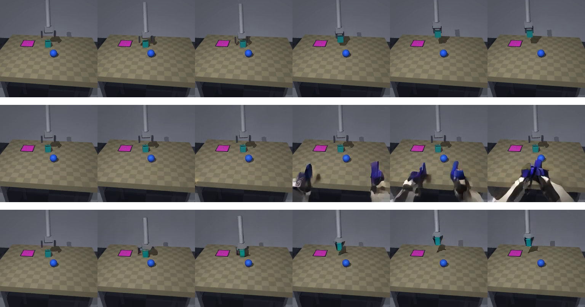
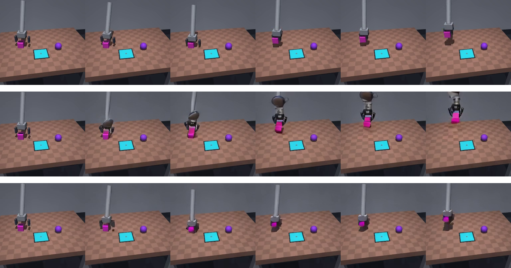

# LoRA fine-tuning scale-up: results

Follow-up to [`LORA_PILOT_RESULTS.md`](LORA_PILOT_RESULTS.md) (800 steps / 40
episodes), scaled up per that doc's own recommendation before drawing conclusions:
same architecture (LoRA on the 112 action-vision attention modules + fresh
domain-embedding rows, no changes), more data and more steps as the only two
variables changed.

## What changed from the mini-pilot

- **Dataset**: 800 train / 80 val / 80 test episodes (was 40 train / 10 val), plus
  window stride 8 -> 4. Net: ~15,300 unique training windows (was ~400) -- the
  repetition ratio over the run's total window-draws dropped from ~22x to ~5.6x.
  Both changes were essentially free in wall-clock terms (dataset generation is
  ~1.7s/episode; training re-samples windows randomly regardless of pool size, so
  more data doesn't cost more training time, only a bit more generation time
  upfront -- see the conversation that led here, prompted by a good question about
  whether 400 episodes was actually a good use of the time budget).
- **Run length**: 21,483 steps / 645 minutes (10.75h), stopped cleanly by the
  `--max-hours` wall-clock cap (not a step-count target) -- vs. the pilot's 800
  steps / 24 minutes. ~26x more steps.
- **Eval sample size**: 25 held-out **test**-split episodes (geometrically disjoint
  from both train and val -- never seen during training *or* during overnight
  monitoring) instead of 5 val episodes, for a materially less noisy read.
- Launched as a fully OS-detached process (`setsid`+`nohup`+`disown`, verified
  reparented to PID 1 with no controlling terminal) so it ran unattended overnight,
  independent of the SSH/VSCode session.

## Training run health

Loss (mean over ~160-microstep windows, matching the 4x grad-accum):

| phase | avg loss |
|---|---|
| first ~40 steps | 0.090 |
| middle of run | 0.048 |
| last ~40 steps | 0.042 |

Steady decline early, decelerating but still improving by the end -- not a hard
plateau, but clearly diminishing returns per additional step at this point. VRAM
held flat at 15.4 GiB for the entire run; no OOMs, no crashes, no GPU contention.

## Before / after, on 25 held-out TEST episodes (not val -- a cleaner number)

| metric | baseline (untrained domain 21) | after 21,483 steps |
|---|---|---|
| mean grasp/stay `frame_diff_energy` ratio | 1.654 | 1.644 |
| cube-displacement direction agreement with GT | 0.60 (15/25) | **0.84 (21/25)** |

Same pattern as the mini-pilot, now on a 5x larger, cleanly held-out sample:
direction-correctness improved substantially (60% -> 84%) and energy-magnitude
sensitivity still hasn't moved, even with 26x more steps and ~38x more unique
training windows. This is no longer a small-sample fluke -- it's a real,
reproducible split in what this training setup does and doesn't fix.

## The visual story is more decisive than the numbers

Both held-out test episodes show the same pattern the mini-pilot found: the
untrained baseline (domain 21 with random action-projection weights) hallucinates
outright -- dark robotic fingers materializing mid-rollout in one, a humanoid
head-and-torso emerging from the gripper in the other. **After training, neither
hallucination happens.** The predicted rollout stays visually stable and tracks the
(near-static, in both these examples) ground truth closely. This is the same
"hallucination -> stability" shift the mini-pilot found, now confirmed at scale and
on genuinely held-out episodes rather than the same 5 windows repeatedly eyeballed.

## Honest read

This is a real result, not a wash. Cosmos3-Edge with this LoRA adaptation has
learned to produce stable, plausible video conditioned on this rendering style
instead of either ignoring the render (the original VALIDATION.md finding for the
pretrained bridge/umi domains) or hallucinating wildly (this new domain's untrained
starting point). Direction-correctness at 84% on held-out episodes is a genuinely
usable signal for many purposes.

What it has *not* yet learned is to modulate *how much* it moves in proportion to
the action's magnitude -- the grasp/stay energy ratio staying flat at ~1.65
regardless of training extent suggests this isn't a "needs more time" problem, but
more likely a capacity/objective one: attention-only LoRA (112 modules, 3.2M params)
may not have a big enough surface to learn fine-grained magnitude sensitivity, even
though it's clearly enough surface to learn "produce a stable scene, respect
directionality." FINETUNING_SCOPE.md's tier-3 fallback (`mlp_moe_gen` LoRA, 84 more
modules) is the documented next lever if magnitude sensitivity turns out to matter
for the eventual policy-training use case -- worth deciding deliberately rather
than assuming it's needed, since direction-correctness alone may already be enough
signal for some policy-training approaches (e.g. anything that treats Cosmos
rollouts as a qualitative/relative signal rather than requiring precise dynamics).
