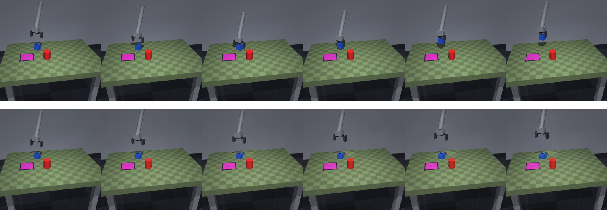

# cosmos-policy

Freeze NVIDIA Cosmos 3 as a virtual environment (action-conditioned world model) and
train a ResNet18-backed CNN policy against it, bootstrapped from the synthetic
pick-and-place data in [`../mujoco-env-dataset`](../mujoco-env-dataset).

## Plan

1. **Environment + Cosmos 3** (done) -- get Cosmos 3 running on this box and prove
   it with a smoke test.
2. **Action-space check** (done) -- confirm `mujoco-env-dataset`'s 7-D
   `[dx, dy, dz, droll, dpitch, dyaw, gripper]` action matches what Cosmos 3's
   `CosmosActionCondition(mode="forward_dynamics", ...)` expects, or work out the
   mapping if not. Pass a real sample image + action sequence from the mujoco dataset
   through Cosmos and confirm the rollout is sane.
3. **Policy training** -- ResNet18 (ImageNet-pretrained) CNN policy, Cosmos 3 frozen
   as the environment it's trained/evaluated against.

## Step 2: aligning mujoco's actions with Cosmos's

Cosmos 3's action-conditioned embodiments (`bridge_orig_lerobot`, `droid_lerobot`,
`umi`, `fractal`, ...) all share one 10-D "unified action representation": 3-D
translation + the 6-D continuous rotation representation of Zhou et al. 2019 (the
rotation matrix's first two columns, flattened) + 1-D gripper. mujoco-env-dataset's
7-D action was already designed Bridge-style -- translation in metres, gripper an
absolute `[0, 1]` aperture -- so the only real gap is the rotation dimensions: 3-D
Euler deltas need expanding into that 6-D form. `mujoco-env-dataset/synthbot/
cosmos_action.py:to_cosmos10` does exactly that and nothing else.

Picked `domain_name="bridge_orig_lerobot"` over the checkpoint's own shipped example
domain (`"umi"`): it's the actual BridgeData/WidowX embodiment -- a tabletop
parallel-jaw gripper, the same task shape as this dataset -- rather than an
egocentric handheld-camera rig. Swapping `domain_name` is a one-line change, no
re-download needed, since it just selects a different set of the transformer's
already-loaded domain-aware action-projection weights.

`mujoco-env-dataset/scripts/export_cosmos_sample.py` exports one 16-step action
chunk (the descend -> grasp -> lift window of a generated episode, converted to
Cosmos's 10-D form) plus its first frame and real ground-truth frames.
`run_mujoco_rollout.py` here feeds that through `Cosmos3-Edge` and writes a
side-by-side comparison:

```bash
cd ../mujoco-env-dataset
.../python scripts/export_cosmos_sample.py --episode dataset/train/ep000000 --out /tmp/cosmos_sample

cd ../cosmos-policy
source env.sh
python run_mujoco_rollout.py --sample /tmp/cosmos_sample
```



Top row: real mujoco frames. Bottom row: Cosmos3-Edge's prediction from the first
frame + our converted actions alone. The gripper's descent and the wrist/base
rotation track the real motion -- evidence the action conversion and domain choice
are at least directionally correct. Two caveats worth being honest about (see the
docstring in `cosmos_action.py`): translation is passed through in world-frame
metres with no verification that Cosmos trained on that frame rather than an
end-effector-relative one, and there's no ground-truth calibration available for
`bridge_orig_lerobot`'s exact gripper-channel convention (unlike `umi`, it doesn't
ship a reference example in this checkpoint).

## This box vs. the DGX Spark demo

`world_models/ai-build-and-learn/topics/cosmos` already has a working Cosmos 3 setup,
but it's hard-pinned to a DGX Spark: arm64, CUDA 13.0, one 119.7 GiB pool shared
between GPU/OS/everything, Flyte/K8s orchestration. This box is x86_64 with one
dedicated 46 GiB L40S and a Flyte-free local workflow, so `setup.sh`/`world.py` here
are rewritten for that, not copied.

Root disk has ~11 GiB free, so the venv and the HF cache both live on
`/opt/dlami/nvme` (217 GiB free ephemeral instance storage) -- see `config.py`.
Nothing there is precious; re-run `setup.sh`/`fetch.sh` if it's ever wiped.

## Model size

Starting with `nvidia/Cosmos3-Edge` (4B params) rather than `Cosmos3-Nano` (16B).
Nano was measured elsewhere at a ~46 GiB peak (weights + VAE decode spike) on a
119.7 GiB *shared* pool; this box's entire GPU *is* 46 GiB with nothing else to lean
on, so Edge is the box that actually has headroom. `world.py`'s `NEEDS_GIB` table has
the per-checkpoint numbers.

## Usage

```bash
./setup.sh                       # venv + torch + diffusers, once
./fetch.sh                       # pull Cosmos3-Edge, once
source env.sh                    # LD_LIBRARY_PATH for pip-installed nvidia/cudnn libs
python smoke_test.py --image     # fastest check, ~10s
python smoke_test.py --action    # action-conditioned rollout
```

`source env.sh` is not optional: without it the pipeline loads fine but the VAE's
conv3d fails on first use (`CUDNN_STATUS_SUBLIBRARY_LOADING_FAILED`) because cudnn's
runtime-compiled JIT engine dlopens its sibling `.so` by soname, and the
pip-installed `nvidia-cudnn-cu13` package's lib directory isn't on any default
linker search path.

## Cosmos3-Edge's shipped action example is UMI, not AgiBotWorld

Every checkpoint ships a ready-to-run `CosmosActionCondition` example under
`assets/`. Nano's is an AgiBotWorld humanoid (29-D actions); **Edge's is UMI**
(Universal Manipulation Interface) -- `domain_name="umi"`, 10-D actions
(`[dx, dy, dz]` + 6-D continuous rotation representation + gripper), 16-step chunks,
256px, ego view. That's a much closer match to mujoco-env-dataset's 7-D
`[dx, dy, dz, droll, dpitch, dyaw, gripper]` (position delta + orientation + gripper,
just Euler angles instead of the 6-D rotation representation) than a humanoid domain
would be -- worth keeping in mind for step 2.
